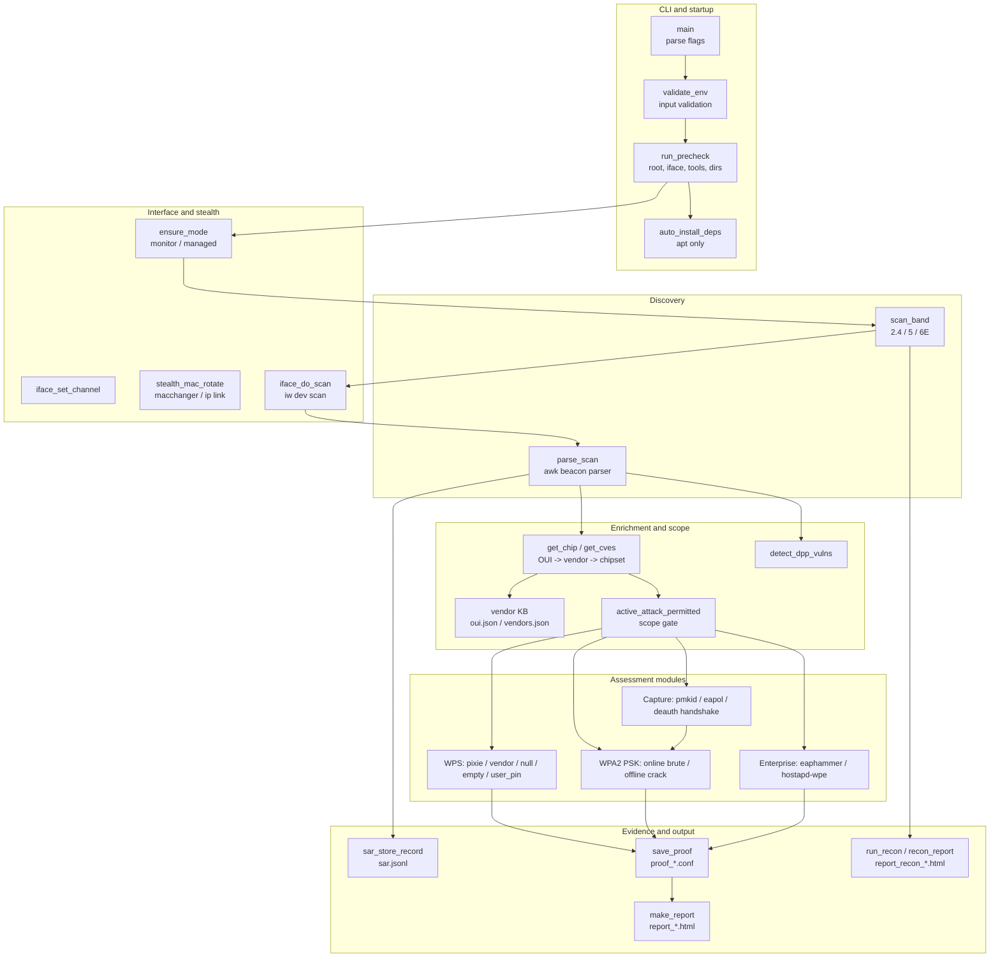
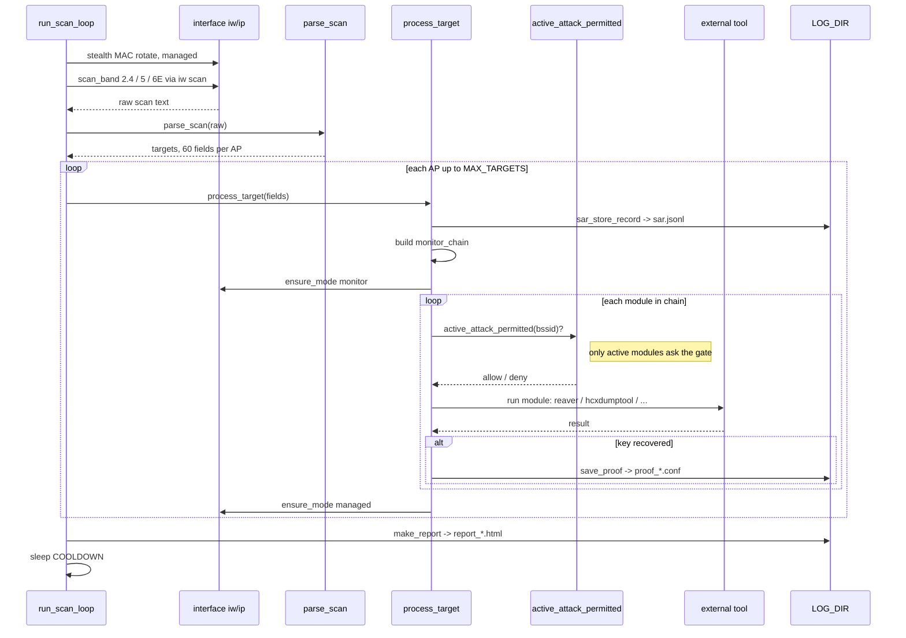
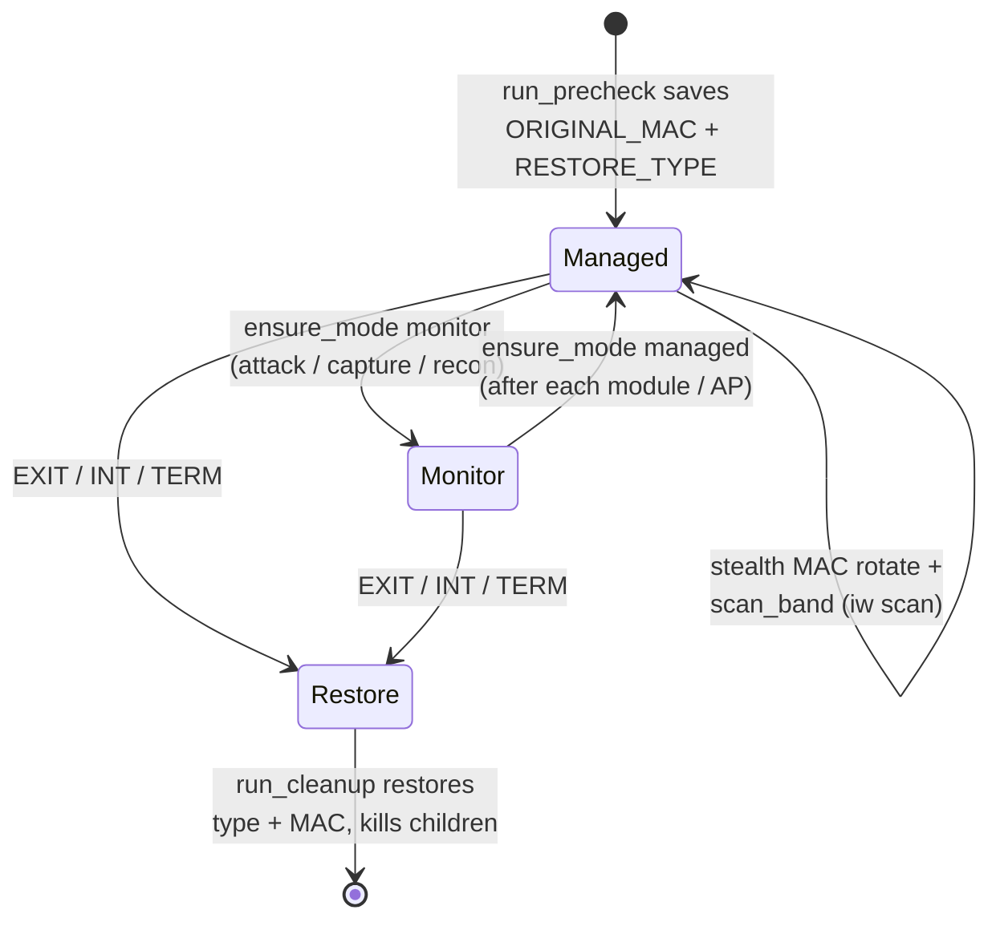
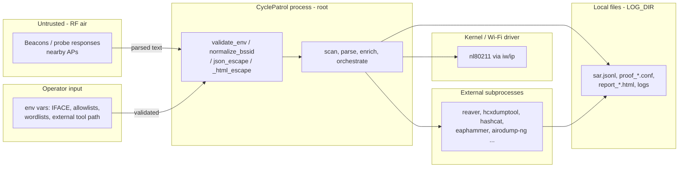

# Architecture

CyclePatrol is a single Bash script (`cp.sh`). There is no server, no database, no network API.
It is a command-line tool. It talks to a Wi-Fi driver with `iw` / `ip`, and it calls external
wireless tools as child processes. State lives in Bash variables and in flat files under `LOG_DIR`.

## Runtime shape

- **One process, one loop.** `main` → `run_precheck` → `run_scan_loop` (endless). Child processes
  (`reaver`, `airodump-ng`, `hcxdumptool`, ...) are started and killed per task.
- **Strict mode.** `set -Eeo pipefail`, a safe `IFS` (newline + tab), `inherit_errexit`, `errtrace`.
- **Cleanup trap.** `run_cleanup` runs on `EXIT`, `INT`, `TERM`. It restores the
  interface mode, restores the original MAC, kills background PIDs, copies the session log, and
  removes the temp dir.

## Component view

## Per-round control flow

## Interface mode lifecycle

The adapter moves between `managed` and `monitor`. Scanning and MAC rotation happen in `managed`
(`scan_band`). Captures and active modules flip to `monitor`, then back to `managed`
(through `ensure_mode`). `run_cleanup` restores the original
type and MAC on exit.

## Trust boundaries

**Boundaries to note for a pentester / AppSec review:**

1. **RF air → parser.** Beacon and probe-response data is attacker-controllable input.
   It is parsed by a large `awk` program in `parse_scan`. Values that reach JSON go through
   `json_escape` and values that reach HTML go through `_html_escape`.
   BSSIDs are normalized and checked (`normalize_bssid`, `check_bssid`) before use in shell.
2. **Operator env → process.** `validate_env` checks the interface name, log dir, country code,
   numeric ranges, and the user PIN format. Allowlists and wordlists are read from env/files.
3. **Root boundary.** The tool refuses to run without root (`run_precheck`). It controls the
   Wi-Fi driver and can change MAC, mode, and regulatory domain.
4. **Subprocess boundary.** External tools do the real RF work. CyclePatrol builds their arguments
   from parsed/validated values.
5. **Disk boundary.** Recovered keys are stored on disk (see [`outputs.md`](outputs.md) and
   [`security.md`](security.md)).

## Why these choices (as seen in code)

- **Fail-safe on missing tools.** Each module checks `command -v <tool>` and returns cleanly if the
  tool is absent. Optional tools only print a warning in `run_precheck`.
- **Interface restore.** `ORIGINAL_MAC` and `RESTORE_TYPE` are saved in `run_precheck` and restored
  in `run_cleanup`, so the adapter is left in a clean state.
- **De-dup state.** `processed_bssids.txt` / `known_bssids.txt` stop repeated work on the same AP.
