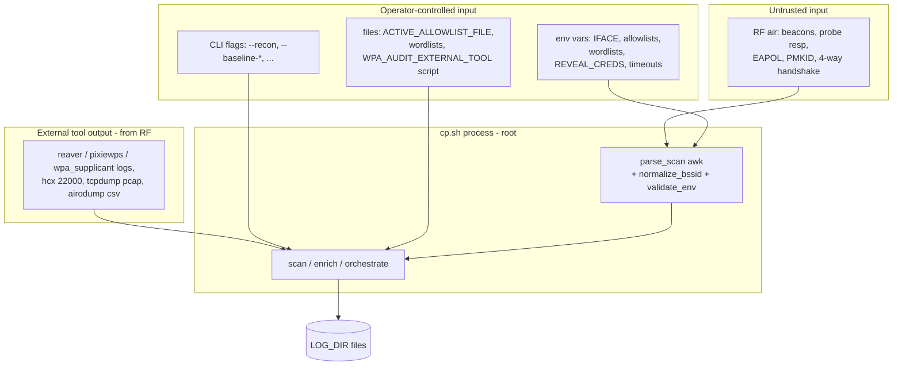
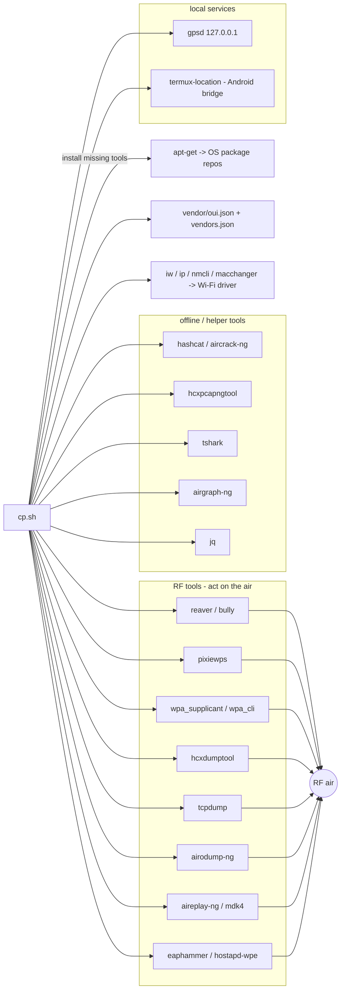
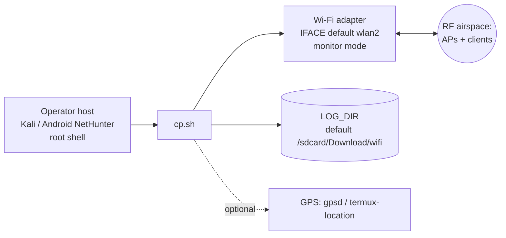

# Attack surface and external dependencies

CyclePatrol is a **single-process CLI tool**, run as root on Linux / Android. It has no HTTP server,
no login, no database, and no network listener. So the attack surface is not web routes. It is:

- radio input from the air (untrusted),
- operator-controlled input (CLI flags, env vars, files),
- output from external tools (which comes from the air),
- the local filesystem it writes to.

This page maps those inputs. It is for system understanding and defensive review. It has no
exploitation steps.

## Entry points (where data enters)

| Entry point | Reaches code at | Validation / handling |
|---|---|---|
| `iw scan` beacon text | `parse_scan` | awk parser; values escaped by `json_escape` / `_html_escape` |
| BSSID from scan | `process_target` | `normalize_bssid` + `check_bssid` before shell use |
| CLI flags | `main` | fixed `case` list; unknown flag → warning |
| env vars (numeric) | `validate_env` | range-checked; bad value → default or `FATAL` |
| `IFACE` | `validate_env` | regex `^[a-zA-Z0-9._-]{1,32}$` |
| `LOG_DIR` | `validate_env` | rejects `..` and leading `-` |
| `USER_PROVIDED_PIN` | `validate_env` | must be 8 digits |
| allowlist file / CSV | `allowlist_load_file` / `_csv` | each token normalized as BSSID |
| capture files (pcap, 22000) | capture modules | parsed by `tcpdump` / `hcxpcapngtool` / `aircrack`/`hashcat` |
| `WPA_AUDIT_EXTERNAL_TOOL` | `wpa_audit_external_dispatch` | executed if `WPA_AUDIT_MODE=external`; see security.md O4 |

## External dependencies and direction

Notes:
- The **only non-radio network egress** is `apt-get` in `auto_install_deps`. The code
  comment and logic restrict it to the OS package manager (signed repos), no `curl | bash`.
- `gpsd` is reached on `127.0.0.1`; `termux-location` is a local Android bridge. No remote server.
- `vendor/oui.json` and `vendor/vendors.json` are read locally (`ENABLE_VENDOR_KB`).

## Runtime / deployment

No Docker, Compose, Kubernetes, CI, or cloud config exists in the repo. "Deployment" is: copy the
script to a Linux / Kali NetHunter host and run it as root with a monitor-capable Wi-Fi adapter.

## What does NOT apply (verified absent)

The spec lists web-app concepts. This tool has none of them. Confirmed from the repo:

| Concept | Status | Why |
|---|---|---|
| HTTP API / routes | none | no web server or router in code |
| Login / sessions / cookies | none | no interactive auth; root is required by the OS |
| JWT / tokens | none | not used |
| Database / ORM / migrations | none | state is flat files (`sar.jsonl`, `*.txt`, proof files) |
| Webhooks | none | no inbound callbacks |
| Queue / message broker / worker service | none | target loop is sequential in `run_scan_loop`; only per-tool child processes with `wait` + `timeout` |
| Scheduled jobs / cron | none | the loop sleeps `COOLDOWN` between rounds; no scheduler |
| Reverse proxy / TLS config | none | no network service to terminate |
| Docker / CI / CD | none | only `cp.sh`, `vendor/`, `README.md`, `LICENSE` in repo |

> `ENABLE_MULTITHREADING` / `MAX_CORES` only affect the `pixiewps` step inside
> `attack_pixie`. They do not create a parallel target pipeline.

The authorization / scope model and the confirmed security observations are in
[`security.md`](security.md). Trust boundaries are in [`architecture.md`](architecture.md#trust-boundaries).
