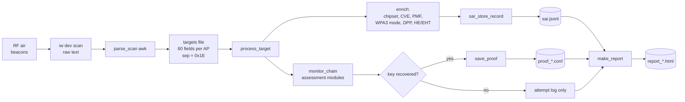
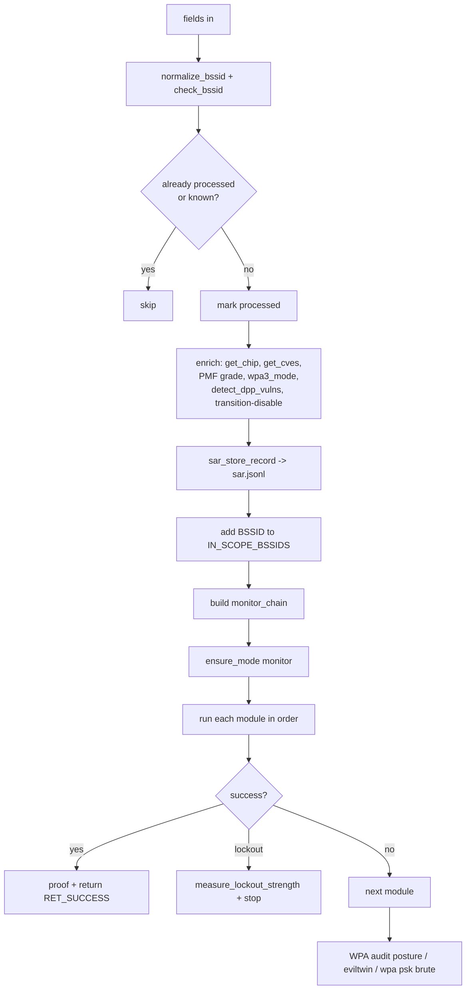
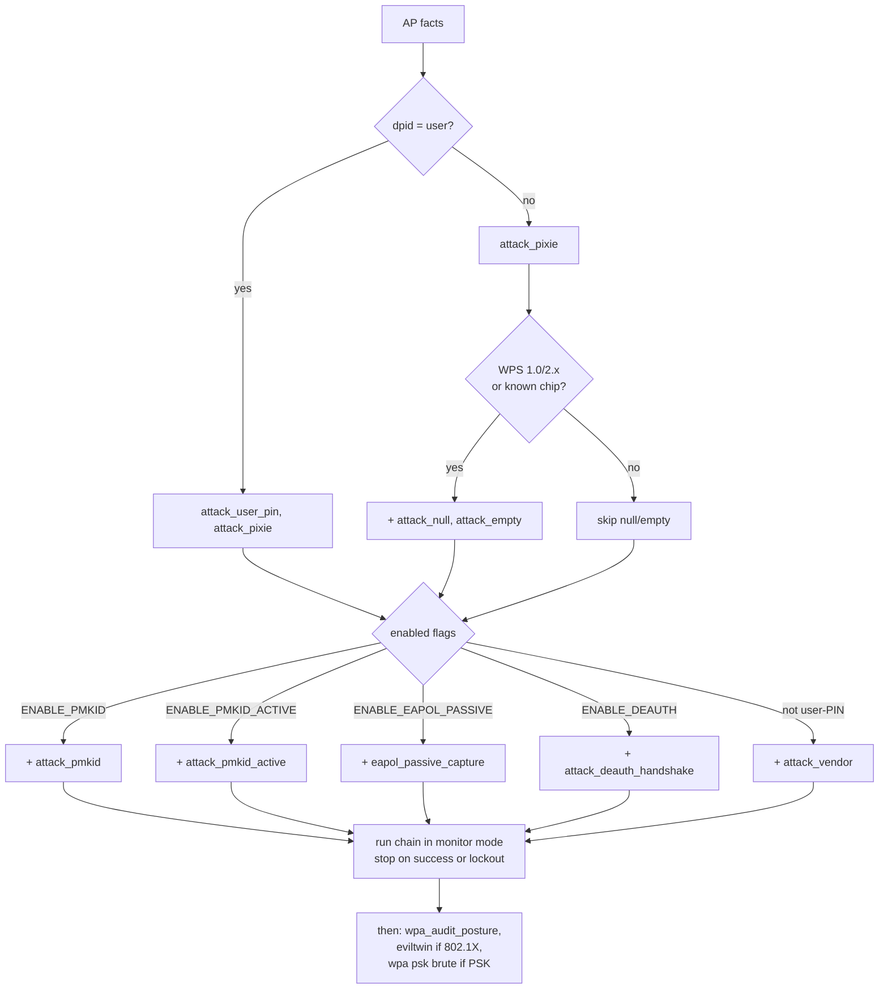
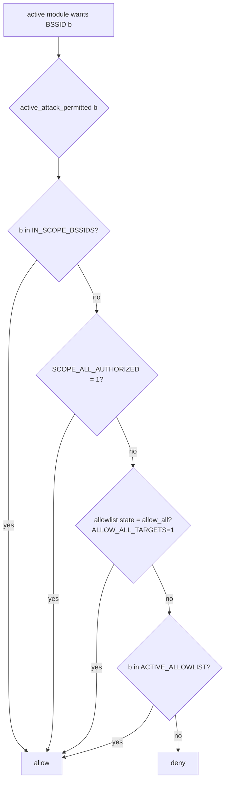
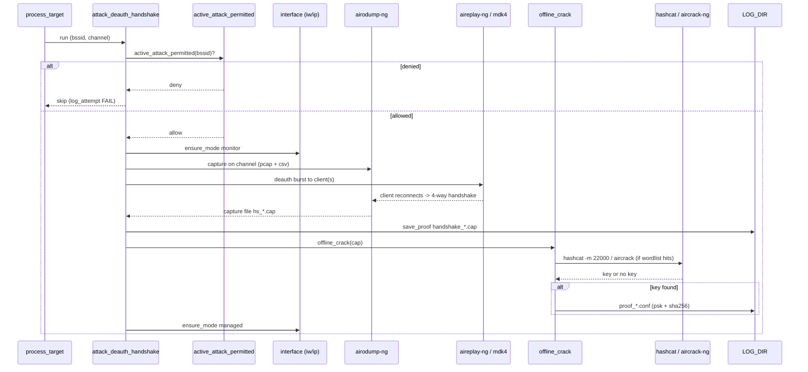

# Data flow

This page follows the data from the air to the report.

## End-to-end

## 1. Scan

- `run_scan_loop` calls `scan_band` for each enabled band: `2.4` (default on), `5` (on), `6E` (on).
  Channel lists: `BAND_24`, `BAND_5`, `BAND_6E_PSC`.
- `scan_band` turns channels into frequencies (`chan2freq`) and runs
  `iw dev <iface> scan freq ...` with a `SCAN_TIMEOUT` (default 25s). Output is appended to a raw file.
- Before each round, if `ENABLE_STEALTH_MAC=1`, the MAC is rotated in managed mode.

## 2. Parse

- `parse_scan` is a large `awk` program. It reads the raw `iw scan` text and builds **one line per
  AP** with about **60 fields**, joined by the ASCII record separator `0x1E`.
- Fields parsed from the beacon / RSN / RSNXE / WPS / vendor elements, for example:
  - identity: `bssid`, `essid`, `signal`, `channel`, `freq`
  - WPS: `wps_state`, `wps_ver`, `device_password_id` (`dpid`), `config_methods`, `wps_hidden`, `sel_reg`,
    device info (`maker`, `model`, `fw`, `devname`, `serial`, `uuid`)
  - crypto: `akm_list`, `pmf`, `rsn_caps`, `rsn_gw/pw/gm` ciphers, `tkip`, `wpa1`, `wpa3`, `owe`
  - RSNXE: `rsnxe_list`, `rsnxe_cap_hex` (SAE-H2E, SAE-PK, Trans-Disable, PMF bits, ...)
  - DPP: `dpp`, `dpp_ver`, `dpp_conf`, `dpp_pkex`
  - Wi-Fi 6 (HE) and Wi-Fi 7 (EHT): capability flags and raw hex

## 3. Process per AP

`process_target` runs for each parsed AP (up to `MAX_TARGETS`, default 20):

The module order (`monitor_chain`) is decided from the AP facts:

- If the AP needs a user PIN (`dpid=user`): `attack_user_pin` then `attack_pixie`.
- Else: `attack_pixie`, and for WPS 1.0 / 2.x or a known chip family also `attack_null`, `attack_empty`.
- Then, if enabled: `attack_pmkid`, `attack_pmkid_active`, `eapol_passive_capture`,
  `attack_deauth_handshake`, and `attack_vendor` (when not user-PIN).
- After the monitor chain: `wpa_audit_posture`, optional external WPA audit, enterprise evil-twin
  (if AKM is 802.1X), and WPA2-PSK brute (if AKM is PSK).

### How the chain is built (`process_target`)

## 4. Scope decision

Note: `process_target` adds every scanned BSSID to `IN_SCOPE_BSSIDS` **before** the modules run.
So the first check is already true for any AP the scanner saw. See [`security.md`](security.md)
for the default-posture impact. Only active modules call the gate; the WPS PIN chain and the
passive PMKID/EAPOL capture do not (see [`modules.md`](modules.md)).

## 5. Evidence and report

- `sar_store_record` writes one JSON line per AP to `sar.jsonl` (chmod 600).
- `save_proof` writes a proof file when a key is recovered: PIN, PSK, PSK SHA-256, method, and a
  `live_verified` marker (from `verify_psk_live`, a one-shot `wpa_supplicant` association).
- `make_report` builds the HTML report from the SAR records, proof files, and attempt log.

## Field transport detail

| Stage | Form | Separator / format |
|---|---|---|
| `iw scan` → parser | text | native `iw` output |
| parser → loop | targets file | field sep `0x1E`, one AP per line |
| loop → `sar.jsonl` | JSON | one object per line (JSONL) |
| finding → proof | `key: value` text | `proof_*.conf` |
| report | HTML | `report_*.html` |

## Example runtime: deauth-assisted handshake → crack

One active module, end to end (`attack_deauth_handshake` → `offline_crack`).
It shows the scope gate, the monitor-mode flip, and proof writing.

`ENABLE_DEAUTH_BROADCAST=1` lets the deauth go broadcast when no client is found this is
DoS-class. Offline crack only recovers a key if the passphrase is in the wordlist.
