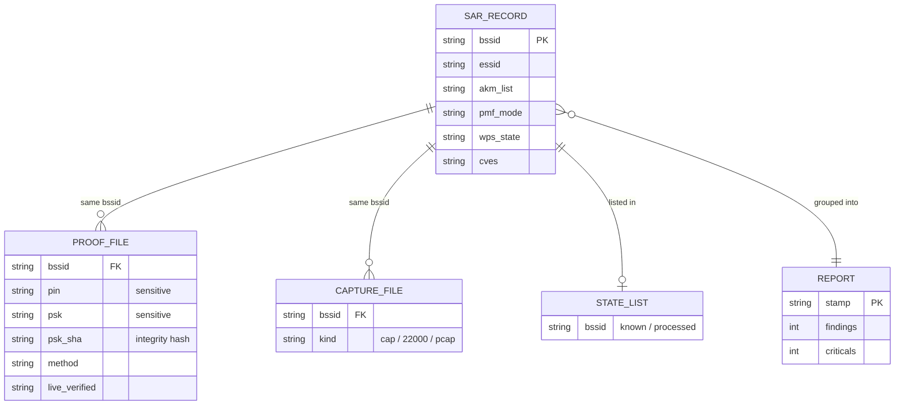

# Outputs and reports

All output goes under `LOG_DIR` (default `/sdcard/Download/wifi`).
The dir is created with `chmod 700`; data files use `chmod 600` (`run_precheck`, `save_proof`,
`sar_store_record`). Whether these modes are enforced depends on the filesystem — see
[`security.md`](security.md).

## Files

| Path | Writer | Format | Content |
|---|---|---|---|
| `sar.jsonl` | `sar_store_record` | JSON Lines | one object per AP, all parsed facts |
| `cp_audit.log` | `audit_*` / `print_log` | text | round + AP + attempt log |
| `session_<ts>_<pid>.log` | `run_cleanup` | text | copy of the session log at exit |
| `proof/proof_*.conf` | `save_proof` | `key: value` | recovered PIN / PSK / SHA-256 |
| `proof/handshake_*.cap` | capture modules | pcap | 4-way handshake |
| `proof/pmkid_*.22000` | PMKID modules | hashcat 22000 | PMKID hash line |
| `proof/eapol_*.pcap` | `eapol_passive_capture` | pcap | EAPOL frames |
| `report_<ts>_<pid>.html` | `make_report` | HTML | assessment report |
| `report_recon_<ts>.html` | `recon_report` | HTML | passive recon survey |
| `known_bssids.txt` | `mark_known` | text | BSSIDs with a result |
| `processed_bssids.txt` | `mark_processed` | text | BSSIDs already handled |
| `recon_reported.txt`, `vuln_reported.txt` | `report_state_add` | text | de-dup state |
| `rule_trace.log` | rule engine | text | only if `ENABLE_TRACE_RULES=1` |
| `recon_<ts>-01.csv` / `.kismet.csv` / `.cap` | `airodump-ng` | csv / pcap | recon capture |
| `recon_<ts>-CAPR.png` / `-CPG.png` | `airgraph-ng` | png | recon graphs (optional) |

## Data relationships (keyed by BSSID)

There is no database. State is flat files. The **BSSID** (normalized MAC) is the key that links every
record. The report joins facts, proof, and captures by BSSID.



Runtime maps use the same key: `IN_SCOPE_BSSIDS`, `SESSION_PROCESSED`, `FOUND_SEEN`, `OUI_CACHE`
(see [`project-structure.md`](project-structure.md)). `pin` / `psk` are the only secret fields; they
live in `PROOF_FILE` only, not in `sar.jsonl`.

## `sar.jsonl` schema

One JSON object per line. Keys written by `sar_store_record`, plus HE/EHT keys added by
`he_sar_enrich_json` / `eht_sar_enrich_json`, plus vendor KB keys from `vendor_kb_enrich_sar_json`.

| Group | Keys |
|---|---|
| meta | `sar_version`, `report_version`, `time` |
| identity | `bssid`, `essid`, `signal`, `channel`, `chip`, `cves` |
| WPS | `wps_ver`, `wps_state`, `device_password_id`, `config_methods`, `wps_hidden`, `sel_reg`, `pin_known`, `hidden_pin_candidate`, `cfg_methods_no_pin_display` |
| device | `maker`, `model`, `device_name`, `serial`, `firmware`, `uuid` |
| crypto | `pmf_raw`, `pmf_mode`, `pmf_grade`, `rsn_caps`, `akm_list`, `wpa3`, `wpa3_tm`, `wpa3_mode`, `owe_tm`, `rsn_gw`, `rsn_pw`, `rsn_gm`, `tkip`, `wpa1` |
| RSNXE | `rsnxe_list`, `rsnxe_cap_hex`, `transition_disable`, `td_bitmap`, `extcap_list` |
| DPP | `dpp`, `dpp_ver`, `dpp_conf`, `dpp_pkex`, `dpp_vulns` |
| Wi-Fi 6 (HE) | `he_present`, `he_bss_color`, `he_twt_supported`, `he_*_mu_mimo`, `he_*_ofdma`, `he_160mhz`, `he_spatial_streams`, `he_raw_capabilities_hex`, ... |
| Wi-Fi 7 (EHT) | `eht_present`, `eht_320mhz`, `eht_puncturing_supported`, `eht_mlo_supported`, `eht_mlo_ap`, `eht_spatial_streams`, `eht_mcs_max`, `eht_raw_capabilities_hex`, ... |

All values pass through `json_escape` before they are written.

Short example (values are examples, not from a real network):

```json
{"sar_version":"1","report_version":"4","time":"2026-10-07T12:00:00Z","bssid":"02:00:00:00:00:01","essid":"lab-ap","signal":"-58","channel":"6","chip":"realtek","cves":"CVE-2020-9395","wps_ver":"2.0","wps_state":"configured","akm_list":"PSK","pmf_mode":"opt","pmf_grade":"warn","wpa3":"NO","tkip":"NO"}
```

## Proof file (`proof_*.conf`)

Written by `save_proof` when a key is recovered. Filename:
`proof_<bssid-no-colons>_<epoch>_<pid>.conf`.

| Line | Meaning |
|---|---|
| `# time:` | ISO time |
| `# bssid:` | AP MAC |
| `# essid:` | network name |
| `# chip:` | chipset family |
| `# method:` | module that found it (`pixie`, `vendor`, `wpa_brute`, ...) |
| `# pin:` | recovered WPS PIN (or `<empty>`) |
| `# psk:` | recovered WPA key |
| `# psk_sha:` | SHA-256 of the key (integrity check for a third party) |
| `# live_verified:` | `yes` if a live association confirmed the key |

The PSK SHA-256 lets a reviewer check the proof file was not changed, without exposing the key.
The real key is in this file; the report body can hide it (`REVEAL_CREDS`).

## Report model (`make_report`)

The HTML report has 10 sections, exactly as titled in `make_report`:

1. Executive summary
2. Risk overview
3. Key findings - 30 seconds
4. Assets overview
5. Findings
6. Remediation plan
7. Positive findings
8. Evidence
9. Methodology and limits
10. Final recommendations - top 5

To get a PDF: open the HTML in a browser and print to PDF.

### Severity (`_sev_label`)

| Severity | Color token |
|---|---|
| Critical | `#d92d20` |
| High | `#e8750a` |
| Medium | `#d9a406` |
| Low | `#2563eb` |
| Info | grey |

### Finding state (`_state_badge`)

| State | Meaning | Example finding |
|---|---|---|
| `confirmed` | a key was actually recovered | WPS PIN popped, WPA2 key cracked (Critical) |
| `potential` | a lead, tried but rejected | WPS known-default PIN rejected; registrar open but rejected (High) |
| `beacon` | from the beacon, not an action | PMF / 802.11w off (Medium) |
| `config` | from the AKM / config | no WPA3 SAE (Low) |

> The current `README.md` says the report shows "only confirmed findings". The code shows this is
> not exact: `make_report` also emits `potential`, `beacon`, and `config` findings
> Treat the finding **state** as the truth: only `confirmed` means a key was
> recovered.

Each finding card also carries a short reproduction / standard reference line (`_finding_meta`).
This documentation does not copy those command templates.

## Return codes (`process_target`)

| Code | Name | Meaning |
|---|---|---|
| 0 | `RET_SUCCESS` | a module recovered a key |
| 1 | `RET_LOCKOUT` | AP went into WPS lockout |
| 2 | `RET_FAILED` | ran, nothing recovered |
| 3 | `RET_SKIPPED` | skipped (bad BSSID / already done) |
| 4 | `RET_ERROR` | setup error (e.g. no monitor mode) |
